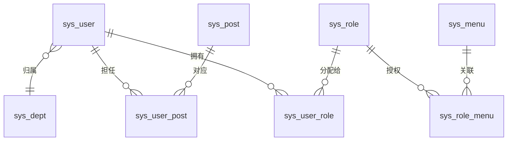
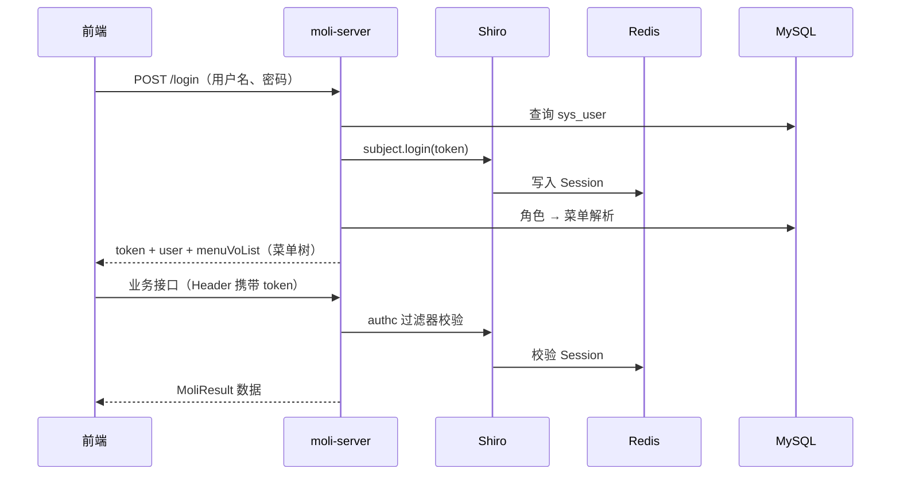

[English](./README.md) | [中文](./README-zh.md) | [日本語](./README-ja.md)

# 茉莉后台管理系统（moli-project-single）

**棠羽管理系统** 的后端服务，基于 **Spring Boot** 的 Java 后台 API 工程，采用 **Maven 多模块** 组织。接口统一返回 `MoliResult<T>`、`PageRes<T>`，内置 **RBAC 权限模型**、**Shiro** 会话鉴权，并提供 **Swagger2** 文档。

> 本仓库仅包含**后端**代码，需配合独立的 Vue 管理端前端（如 vue-element-admin 体系）使用。

## 功能概览

| 业务域 | 能力 |
|--------|------|
| **系统管理** | 用户、角色、菜单、部门、岗位、字典、登录/操作日志 |
| **运营管理** | 项目、服务器、平台、组件部署 |
| **AI** | ChatGPT 相关接口 |
| **多语言** | 菜单、字典支持 **中文 / 英文 / 日文**；用户可设置界面语言 |
| **安全** | Shiro + Redis 会话；验证码可开关（`captcha.enabled`） |
| **存储** | MinIO 对象存储客户端 |

## 技术栈

- **运行环境**：Java 8、Spring Boot 2.3.x
- **数据层**：MySQL 8.x、MyBatis-Plus、Druid
- **缓存 / 会话**：Redis、Jedis、Shiro Redis Session
- **鉴权**：Apache Shiro（SHA-256 + 盐值，迭代 15 次）
- **文档**：Swagger2（Springfox）
- **其他**：EasyExcel、MinIO、AOP 操作日志

## 模块说明

| 模块 | 说明 |
|------|------|
| `moli-parent` | 父工程，统一依赖版本（BOM） |
| `moli-common` | 公共实体、VO、常量、`MoliResult` 等 |
| `moli-server` | Controller、Service、Mapper、Shiro/Redis 配置 |

## RBAC 权限设计

系统采用经典的 **用户 → 角色 → 菜单** 权限模型。菜单同时承担**路由导航**与**权限标识**职责；用户登录后，后端返回其可见的菜单树，前端据此动态渲染侧边栏与页面。

### 数据模型关系



| 表名 | 说明 |
|------|------|
| `sys_user` | 用户账号、资料、`language` 语言偏好、密码哈希与盐 |
| `sys_role` | 角色（名称、状态、排序） |
| `sys_menu` | 目录 / 菜单 / 按钮，`perms` 为权限标识 |
| `sys_user_role` | 用户与角色多对多 |
| `sys_role_menu` | 角色与菜单多对多 |
| `sys_user_post` | 用户与岗位（组织架构，可选） |
| `sys_dept` | 部门树 |

### 菜单类型（`sys_menu.menu_type`）

| 类型 | 编码 | 作用 | 示例 |
|------|------|------|------|
| 目录 | `M` | 侧边栏分组，无独立页面 | 系统管理、运营管理 |
| 菜单 | `C` | 可路由的页面 | 用户管理 |
| 按钮 | `F` | 细粒度操作权限（预留） | `system:user:add` |

### 权限标识（`perms`）

命名规范：**`模块:资源:操作`**

种子数据示例：

- `system:user:list` — 用户列表页
- `system:role:list` — 角色管理
- `operation:project:list` — 运营项目列表
- `chatgpt:completion:list` — AI 对话页

目录节点（`M`）通常 `perms` 为空；页面菜单（`C`）携带 `list` 权限；按钮（`F`）可扩展 `add`、`edit`、`remove` 等。

### 鉴权流程



1. **登录**（`POST /login`）：Shiro 校验账号密码（SHA-256 + 用户盐值），返回：
   - `token` — Shiro Session ID（后续请求携带）
   - `user` — 用户信息（已剔除密码/盐）
   - `menuVoList` — 动态路由菜单树
2. **会话存储**：Session 存于 **Redis**（`RedisSessionDAO`），缓存主键为 `userName`。
3. **路由级权限**：普通用户通过 `sys_user_role` → `sys_role_menu` → `sys_menu` 链路获取可见菜单；`MenuServiceImpl#selectMenuTreeByUserId` 构建树形结构。
4. **超级管理员**：用户名为 `superadmin`（`CommonConstant.SUPER_ADMIN`）时，登录返回全部菜单（`getMenuTreeAll()`）。
5. **接口拦截**：`ShiroConfig` 对 `/**` 启用 `authc`；`/login`、Swagger、静态资源等为 `anon` 放行。
6. **按钮级权限**：`F` 类型菜单的 `perms` 供前端指令（如 `v-permission`）使用；`ShiroRealm#doGetAuthorizationInfo` 中服务端注解鉴权逻辑尚未完全启用，可按需扩展 `@RequiresPermissions`。

### 权限配置典型流程

1. 在**菜单管理**维护菜单（或执行 `docs/sql/` 基线初始化，见下文）。
2. 创建**角色**，勾选菜单 ID 写入 `sys_role_menu`。
3. 创建**用户**，分配角色 ID 到 `sys_user_role`。
4. 用户登录 → 前端根据 `menuVoList` 渲染侧边栏 → 仅可访问已授权页面。

### 多语言菜单

`sys_menu` 含 `menu_name`、`menu_name_en`、`menu_name_ja` 三语字段；`I18nUtils` 根据用户 `language`（`zh-CN` / `en-US` / `ja-JP`）返回对应文案。

## 环境要求

- JDK 8
- Maven 3.6+
- MySQL 8.x
- Redis

## 数据库初始化

```bash
mysql -u root -p -e "CREATE DATABASE IF NOT EXISTS moli DEFAULT CHARSET utf8mb4;"
mysql -u root -p moli < docs/sql/00_schema.sql
mysql -u root -p moli < docs/sql/01_baseline_data.sql
```

详见 `docs/sql/README.md`。结构或种子变更后可在本机执行 `python scripts/export_db_baseline.py` 重新导出。

## 快速开始

1. **本地安装父 POM**：

   ```bash
   cd moli-parent && mvn -DskipTests install && cd ..
   ```

2. **编译**：

   ```bash
   mvn -pl moli-common,moli-server -am -DskipTests package
   ```

3. **开发配置** — 修改 `moli-server/src/main/resources/application-dev.yml`（数据库、Redis、MinIO 等）。`application.yml` 默认 profile 为 `dev`。

4. **生产配置** — **切勿将真实密码提交到 Git**。复制模板并通过环境变量注入：

   ```bash
   cp moli-server/src/main/resources/application-pro.yml.example \
      moli-server/src/main/resources/application-pro.yml
   ```

   设置 `SPRING_DATASOURCE_PASSWORD`、`SPRING_REDIS_PASSWORD`、`MINIO_ACCESS_KEY`、`MINIO_SECRET_KEY` 等。

5. **启动**：

   ```bash
   cd moli-server && mvn -Dmaven.test.skip=true spring-boot:run
   ```

6. **Swagger**（`swagger.show: true` 时）：`http://localhost:<端口>/swagger-ui.html`，端口见 `application.yml`。

## 接口返回规范

```json
{
  "code": 200,
  "msg": "success",
  "data": { }
}
```

分页列表使用 `PageRes<T>`（`records`、`total`、`pageNum`、`pageSize`）。

## 相关文档

- [AWS 部署指南（MySQL + Nginx + Redis）](docs/aws-deployment-guide.md)
- [接口迭代地图](docs/api-iteration-map.md)
- [项目迭代基线](docs/project-iteration-baseline.md)
- [依赖安全治理路线图](docs/dependency-security-roadmap.md)
- AI 协作：[AGENTS.md](AGENTS.md) / [AGENTS.en.md](AGENTS.en.md)

## 许可证（License）

Copyright (c) 2026 **wujinsen**

本项目基于 **[MIT License](LICENSE)** 开源。

您可以自由使用、复制、修改、合并、发布、分发、再许可和/或销售本软件，但须满足：

- 在所有副本或重要部分中保留版权声明和许可声明；
- 软件按 **「原样」** 提供，不提供任何形式的担保。

完整条款见 [LICENSE](LICENSE) 文件。
