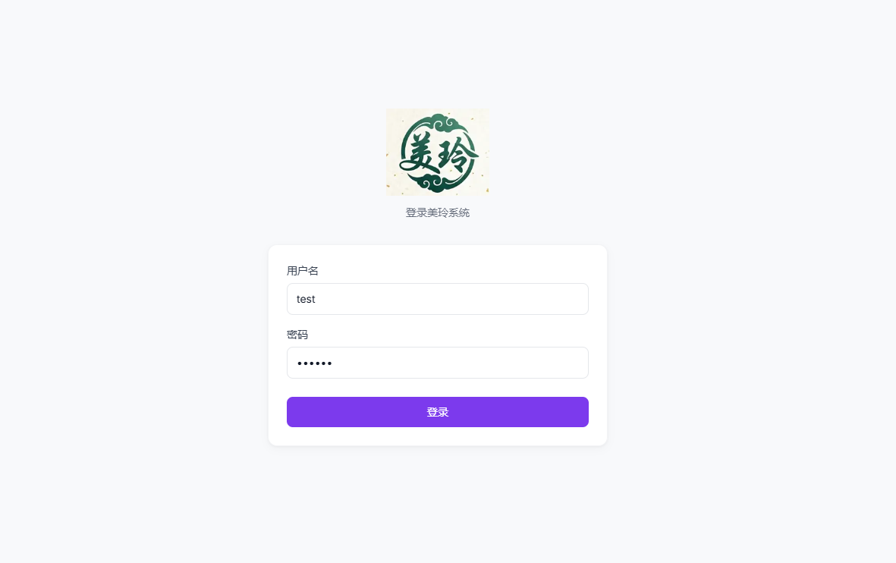
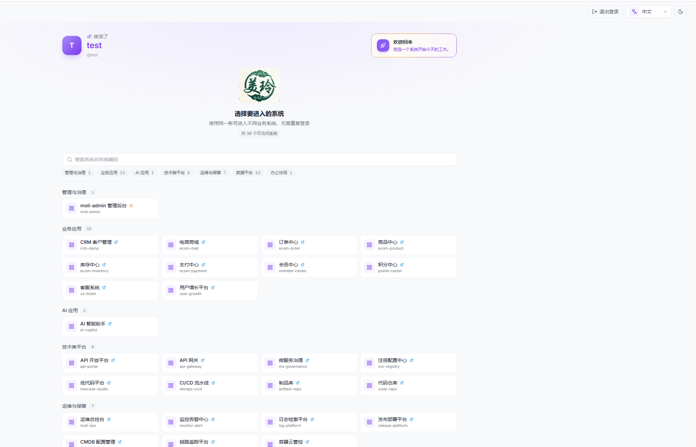
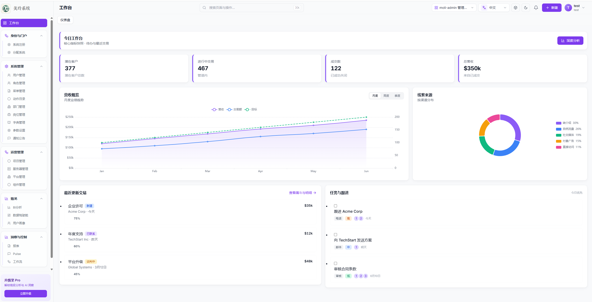
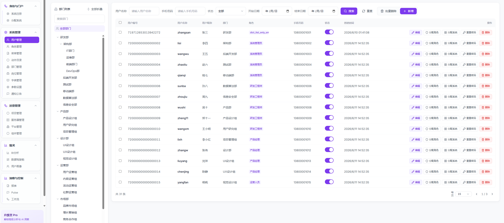
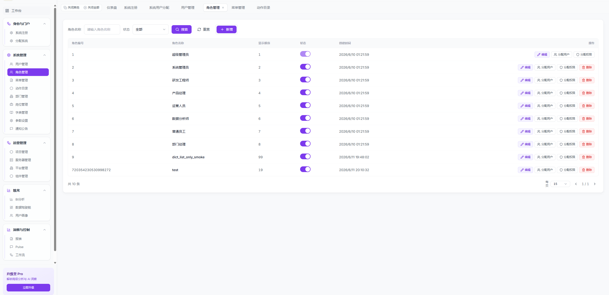
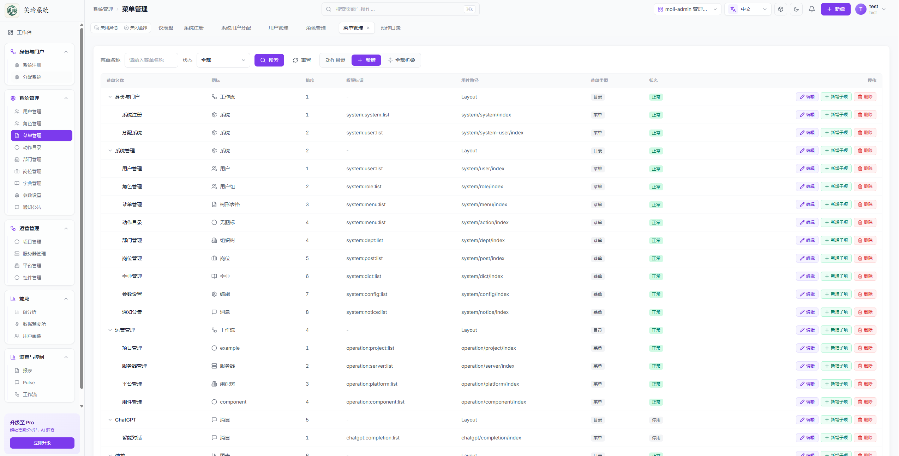
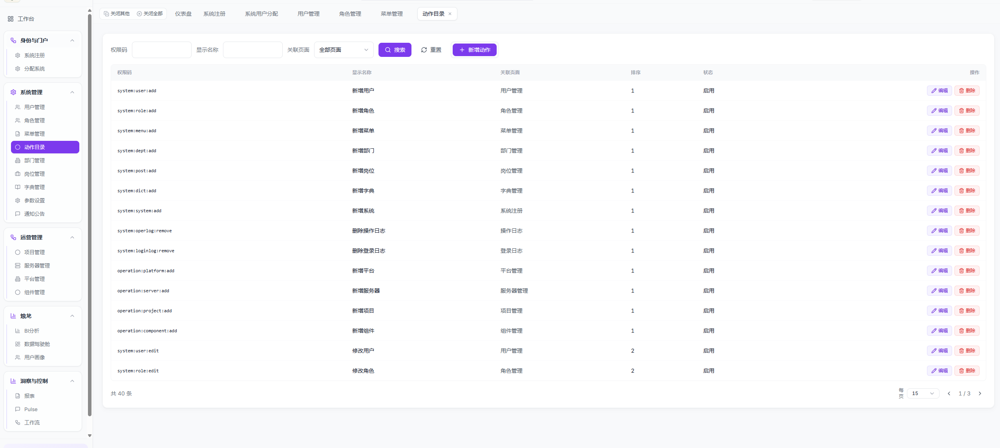
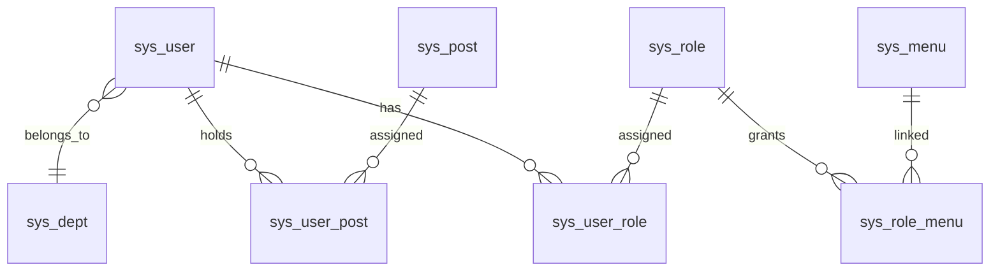
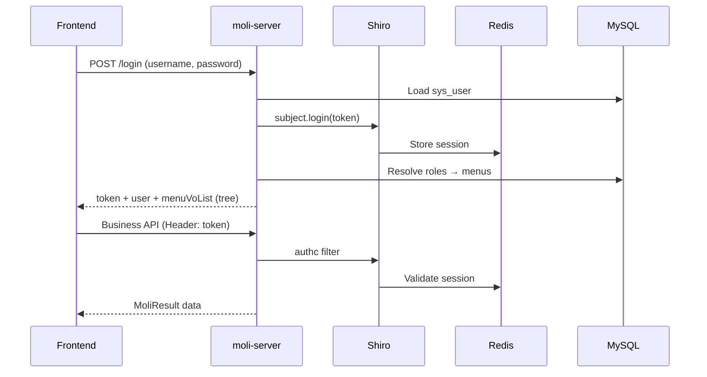

[中文](./README-zh.md) | [English](./README.md) | [日本語](./README-ja.md)

# Moli Admin (moli-project-single)

A **Java admin backend** for the **Moli Management System** (茉莉管理系统). Built with Spring Boot as a Maven multi-module project, it exposes REST APIs with unified `MoliResult<T>` / `PageRes<T>` responses, **RBAC** (role-based access control), Shiro session auth, and Swagger2 documentation.

> This repository is the **backend API**. Screenshots below are from the companion Vue admin UI (`meiling-ui`), integrated via REST + Shiro Session.

## Screenshots

| Login | Multi-system portal |
|:---:|:---:|
|  |  |
| Single sign-on entry with i18n | Grouped portal listing accessible systems (38 in demo seed) |

| Dashboard | User management |
|:---:|:---:|
|  |  |
| Workbench after entering moli-admin | Dept tree filter, role/system assignment, password reset |

| Role management | Menu management |
|:---:|:---:|
|  |  |
| Roles, user assignment, menu + action grants | Tree editor for directories and page menus |



Action catalog (P4): maintain write-action codes such as `system:user:add` for role grants and button-level auth.

> Assets live in `PIC/`. Replace files in place when the UI changes.

## Features

| Domain | Capabilities |
|--------|----------------|
| **System** | Users, roles, menus, departments, posts, dictionaries, login/operation logs |
| **Operations** | Projects, servers, platforms, component deployment |
| **AI** | ChatGPT integration endpoints |
| **i18n** | Menu and dictionary labels in **zh-CN / en-US / ja-JP**; per-user language preference |
| **Security** | Shiro + Redis session; optional captcha (`captcha.enabled`) |
| **Storage** | MinIO client for object storage |

## Tech stack

- **Runtime**: Java 8, Spring Boot 2.3.x
- **Data**: MySQL 8.x, MyBatis-Plus, Druid
- **Cache / session**: Redis, Jedis, Shiro Redis session & cache
- **Auth**: Apache Shiro (SHA-256 + salt, 15 iterations)
- **Docs**: Swagger2 (Springfox)
- **Other**: EasyExcel, MinIO client, AOP operation logging

## Modules

| Module | Role |
|--------|------|
| `moli-parent` | Parent BOM / dependency versions |
| `moli-common` | Shared entities, VOs, constants, utilities, `MoliResult` |
| `moli-server` | Controllers, services, mappers, Shiro/Redis/Swagger config |

## RBAC design

The system uses a classic **User → Role → Menu** RBAC model. Menus carry both **navigation** and **permission identifiers**; the frontend renders routes and buttons from the menu tree returned at login.

### Entity relationships



| Table | Purpose |
|-------|---------|
| `sys_user` | Account, profile, `language`, password hash + salt |
| `sys_role` | Role definition (name, status, sort) |
| `sys_menu` | Directory / page / button; `perms` permission string |
| `sys_user_role` | User ↔ role (N:N) |
| `sys_role_menu` | Role ↔ menu (N:N) |
| `sys_user_post` | User ↔ post (organizational, optional) |
| `sys_dept` | Department tree |

### Menu types (`sys_menu.menu_type`)

| Type | Code | Purpose | Example |
|------|------|---------|---------|
| Directory | `M` | Sidebar group, no leaf page | System, Operations |
| Menu | `C` | Routable page | User management |
| Button | `F` | Fine-grained action (reserved) | `system:user:add` |

### Permission identifier (`perms`)

Format: **`module:resource:action`**

Examples from seed data:

- `system:user:list` — user list page
- `system:role:list` — role management
- `operation:project:list` — operations project list
- `chatgpt:completion:list` — AI chat page

Directories (`M`) usually have `perms = NULL`; leaf menus (`C`) carry the list permission. Button rows (`F`) can add `add`, `edit`, `remove`, etc.

### Authorization flow



1. **Login** (`POST /login`): Shiro authenticates credentials (SHA-256 + per-user salt). Response includes:
   - `token` — Shiro session ID (client sends on subsequent requests)
   - `user` — profile (password/salt stripped)
   - `menuVoList` — route tree for dynamic sidebar
2. **Session**: Stored in **Redis** via `RedisSessionDAO`; cache keyed by `userName`.
3. **Route-level access**: Non–super-admin users receive menus only through `sys_user_role` → `sys_role_menu` → `sys_menu`. `MenuServiceImpl#selectMenuTreeByUserId` builds the tree.
4. **Super admin**: Username `superadmin` (`CommonConstant.SUPER_ADMIN`) receives the full menu tree via `getMenuTreeAll()` at login.
5. **API gateway**: `ShiroConfig` applies `authc` to `/**`; `/login`, Swagger paths, and static assets are `anon`.
6. **Button-level access**: `perms` on `F` rows are intended for frontend `v-permission` / directive checks; Shiro `@RequiresPermissions` wiring in `ShiroRealm#doGetAuthorizationInfo` is partially stubbed — extend there for server-side enforcement.

### Role assignment (typical workflow)

1. Create menus in **Menu management** (or run the `docs/sql/` baseline; see below).
2. Create a **Role** and bind menu IDs (`sys_role_menu`).
3. Create a **User** and assign role IDs (`sys_user_role`).
4. User logs in → frontend builds sidebar from `menuVoList` → only authorized pages are reachable.

### Multilingual menus

`sys_menu` stores `menu_name`, `menu_name_en`, `menu_name_ja`. `I18nUtils` picks the label from the user’s `language` field (`zh-CN` / `en-US` / `ja-JP`).

## Prerequisites

- JDK 8
- Maven 3.6+
- MySQL 8.x
- Redis

## Database setup

```bash
mysql -u root -p -e "CREATE DATABASE IF NOT EXISTS moli DEFAULT CHARSET utf8mb4;"
mysql -u root -p moli < docs/sql/00_schema.sql
mysql -u root -p moli < docs/sql/01_baseline_data.sql
```

See `docs/sql/README.md`. Re-export after schema/seed changes: `python scripts/export_db_baseline.py`.

## Quick start

1. **Install parent POM locally**:

   ```bash
   cd moli-parent && mvn -DskipTests install && cd ..
   ```

2. **Build**:

   ```bash
   mvn -pl moli-common,moli-server -am -DskipTests package
   ```

3. **Configure dev environment** — edit `moli-server/src/main/resources/application-dev.yml` (MySQL, Redis, MinIO). Default profile is `dev` in `application.yml`.

4. **Production config** — **do not commit secrets**. Copy the template and use environment variables:

   ```bash
   cp moli-server/src/main/resources/application-pro.yml.example \
      moli-server/src/main/resources/application-pro.yml
   ```

   Set `SPRING_DATASOURCE_PASSWORD`, `SPRING_REDIS_PASSWORD`, `MINIO_ACCESS_KEY`, `MINIO_SECRET_KEY`, etc.

5. **Run**:

   ```bash
   cd moli-server && mvn -Dmaven.test.skip=true spring-boot:run
   ```

6. **Swagger** (when `swagger.show: true`): `http://localhost:<port>/swagger-ui.html` — port is defined in `application.yml` (default in repo may vary).

## API response convention

```json
{
  "code": 200,
  "msg": "success",
  "data": { }
}
```

Paginated lists use `PageRes<T>` (`records`, `total`, `pageNum`, `pageSize`).

## Documentation

- [AWS deployment guide (MySQL + Nginx + Redis)](docs/aws-deployment-guide.en.md)
- [Database schema diagram](docs/database-schema-diagram.en.md)
- [API iteration map](docs/api-iteration-map.md)
- [Project iteration baseline](docs/project-iteration-baseline.md)
- [Dependency security roadmap](docs/dependency-security-roadmap.md)
- AI collaboration: [AGENTS.md](AGENTS.md) / [AGENTS.en.md](AGENTS.en.md)

## License

Copyright (c) 2026 **wujinsen**

This project is licensed under the **[MIT License](LICENSE)**.

You are free to use, copy, modify, merge, publish, distribute, sublicense, and/or sell copies of the software, subject to:

- Including the copyright notice and permission notice in all copies or substantial portions.
- The software is provided **"AS IS"**, without warranty of any kind.

See [LICENSE](LICENSE) for the full text.
