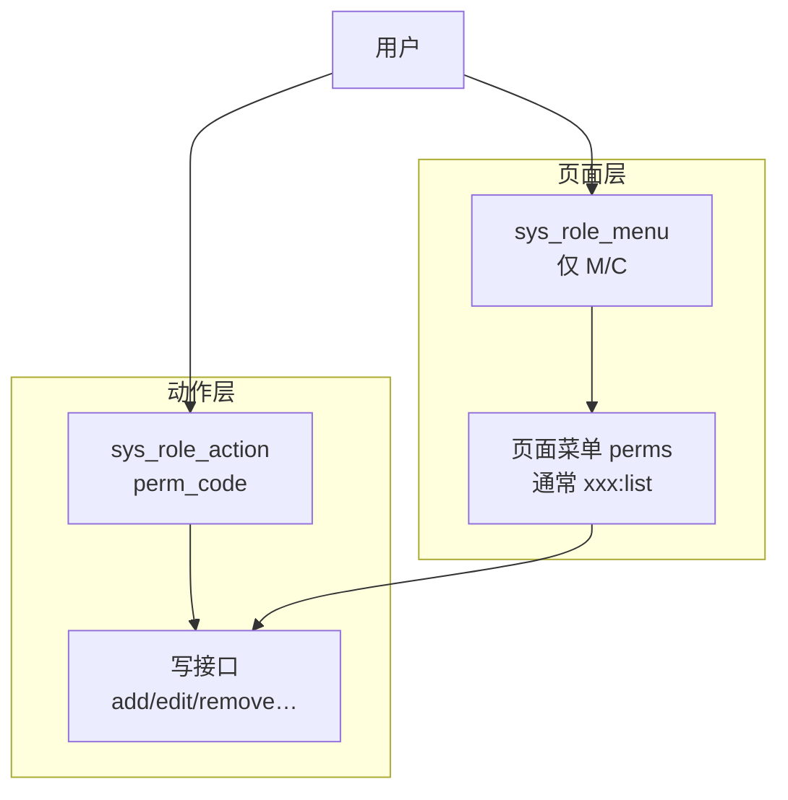
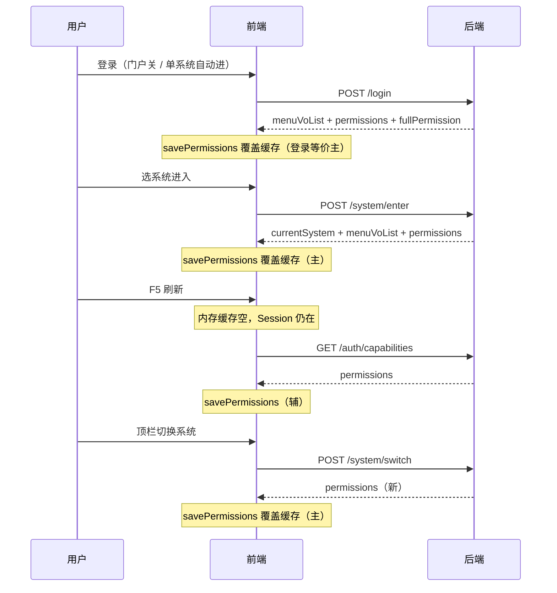
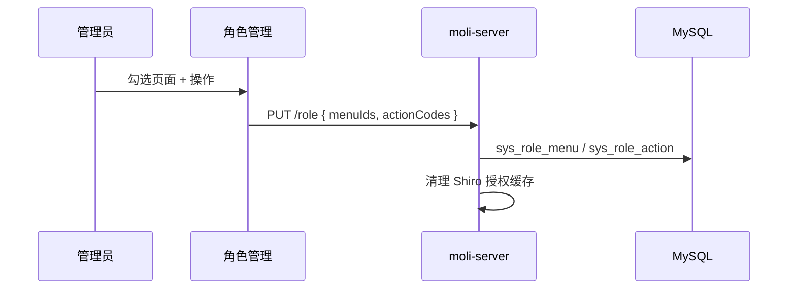
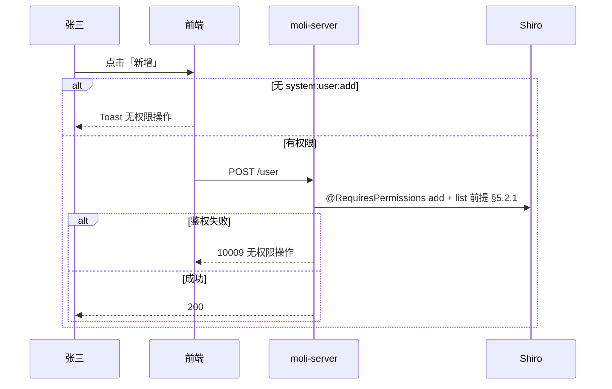

# 动作权限（按钮权限）设计方案

最后更新: 2026-06-11  
状态: **已拍板（§13 #1–#6）**，P1–P4 已落地  
范围: **moli-admin 本系统 RBAC**（不含数据权限、不含外部系统 SSO 侧授权）

> 本文描述「页面能进」与「动作能做」分离后的按钮/操作权限设计。  
> 与 [multi-system-sso-design.md](multi-system-sso-design.md) 关系：系统准入仍由 `sys_user_system` 控制；进入 moli-admin 后的**动作权限**按本文实施。

---

## 1. 背景与问题

### 1.1 现状

| 能力 | 现状 |
|------|------|
| 页面路由 | `sys_menu`（M/C）+ `sys_role_menu`，登录/`getRouters` 构建侧栏 |
| 权限码 | `sys_menu.perms`，`PermissionService` 聚合后进 Shiro |
| 接口鉴权 | 部分 Controller 已加 `@RequiresPermissions`，但写操作多与 `list` 共用同一 perm |
| 菜单类型 F | 文档预留「按钮」，后端几乎无专门逻辑；前端路由/侧栏已排除 F |
| 前端 | 角色授权把 M/C/F 勾在同一棵树；**未下发**独立 `permissions` 列表 |

### 1.2 要解决的问题

1. **动作权限可分配**：如「用户管理」能进列表，但不一定能「新增/删除」。  
2. **产品交互**：**按钮始终展示**；无权限时**点击**提示「无权限操作」（不隐藏按钮）。  
3. **模型清晰**：菜单只管导航，不再用 `menu_type=F` 承载按钮授权。

### 1.3 设计原则

- **导航与动作解耦**：`sys_role_menu` 只表示页面门票；动作单独存储。  
- **权限码是唯一契约**：与 Shiro、`@RequiresPermissions`、前端预检共用同一 `perm_code` 字符串。  
- **安全以后端为准**：前端点击预检仅为体验，接口必须鉴权。  
- **小步落地**：第一期以「用户管理」为样板，验证后再铺其他模块。  
- **不引入 RuoYi 式 data_scope**：数据权限另文档，不在本期范围。

---

## 2. 产品行为（已确认）

### 2.1 示例：张三

| 配置 | 行为 |
|------|------|
| 角色勾选「用户管理」页面（C） | 能进列表；**新增/修改/删除等按钮均可见** |
| 未分配 `system:user:add` | 点「新增」→ 提示 **「无权限操作」**，不打开表单（或打开前拦截） |
| 用 Postman 调 `POST /user` | 返回 **`code: 10009`**，文案 **「无权限操作」**（HTTP 200，见 §5.3） |

### 2.2 页面 vs 动作



| 问题 | 由谁回答 |
|------|----------|
| 侧边栏有没有「用户管理」 | `sys_role_menu` 是否含该 C |
| 列表接口能不能调 | 页面 C 上的 `system:user:list`（随页面授权带入） |
| 「新增」点了有没有反应 | `sys_role_action` 是否含 `system:user:add` |
| 按钮显不显示 | **始终显示**（与动作权限无关） |

### 2.3 有效权限集合

```
effectivePermissions(user) =
    { perms | 来自角色已授权的 C 页面（sys_role_menu → sys_menu，menu_type = 'C' 且 perms 非空） }
  ∪ { perm_code | 来自 sys_role_action }
  ∪ { *:*:* }   （若 superadmin / fullPermission）
```

> **与 §5.1 对齐：** 页面 list 门票挂在 **C** 菜单的 `perms` 上；M 目录一般不承载 perms。`PermissionService` 实现时 join `sys_menu` 可放宽为 `menu_type IN ('M','C')` 以兼容历史数据，但**计入 effectivePermissions 的页面 perm 仅来自 C 行**（M 行 `perms` 通常为空，自然被过滤）。

**规则说明：**

- 勾选页面（C）→ 自动拥有该页 `perms`（一般为 `list`），**不要求**在 `sys_role_action` 再勾一遍 list。  
- 动作（add/edit/remove…）必须在 `sys_role_action` **显式勾选**。  
- 仅有动作、无页面：接口仍应返回 **`code: 10009`**（防止绕过 UI 直接调 API 时扩大页面权；页面权由 list 类接口 + 路由双重约束，见 §12.3）。

---

## 3. 移除 `menu_type = F` 的影响与决策

### 3.1 决策

**正式废弃 F**：`sys_menu` 仅保留 **M（目录）、C（页面）**。

### 3.2 影响评估

| 维度 | 影响 |
|------|------|
| 侧栏 / 路由 | **无负面影响**；前端已 `menuType !== 'F'` 过滤 |
| 后端路由构建 | 无 F 专用逻辑；移除后更简单 |
| 菜单管理 | 去掉「按钮」类型选项 |
| 角色授权 UI | 菜单树只勾 M/C；动作改到独立区域 |
| 历史数据 | 若库中存在 F 行且已勾进 `sys_role_menu`，需迁移到 `sys_role_action`（见 §8） |
| 动作清单从哪来 | 改由 **代码注册表** `sys_action`（见 §4.2），不再查 F 子节点 |

### 3.3 保留字段

`sys_menu.menu_type` 列可保留 VARCHAR，约定只允许 `M`/`C`；可选后续加 CHECK 或应用层校验。

---

## 4. 数据模型

### 4.1 表结构变更

#### 新增 `sys_role_action`（角色动作授权）

```sql
CREATE TABLE sys_role_action (
    role_id    BIGINT       NOT NULL COMMENT '角色ID',
    perm_code  VARCHAR(100) NOT NULL COMMENT '权限码，如 system:user:add',
    PRIMARY KEY (role_id, perm_code),
    KEY idx_perm_code (perm_code)
) COMMENT='角色-动作权限';
```

#### 新增 `sys_action`（动作目录 / 注册表）

动作定义与菜单行脱钩，供角色分配 UI 展示与后端校验「合法 perm_code」：

```sql
CREATE TABLE sys_action (
    id           BIGINT       NOT NULL AUTO_INCREMENT PRIMARY KEY,
    perm_code    VARCHAR(100) NOT NULL COMMENT '权限码，全局唯一',
    resource     VARCHAR(64)  NOT NULL COMMENT '资源，如 user、role',
    action       VARCHAR(32)  NOT NULL COMMENT '动作，如 add、edit、remove',
    name         VARCHAR(100) NOT NULL COMMENT '显示名称，如 新增用户',
    menu_id      BIGINT       NULL COMMENT '关联页面菜单(C)，仅用于 UI 分组',
    order_num    INT          DEFAULT 0,
    status       TINYINT      DEFAULT 1 COMMENT '1启用 0停用',
    UNIQUE KEY uk_perm_code (perm_code),
    KEY idx_menu_id (menu_id)
) COMMENT='系统动作目录（非导航）';
```

> **第一期**也可仅用 `PermissionConstants` + 种子 SQL 写入 `sys_action`，不必做「动作管理」后台页。

#### 不变

| 表 | 用途 |
|----|------|
| `sys_menu` | 仅 M/C 导航 |
| `sys_role_menu` | 仅保存 M/C 的 `menu_id` |
| `sys_user_role` | 用户角色，不变 |

### 4.2 权限码命名

沿用现有约定：**`模块:资源:操作`**

```
system:user:list    -- 页面/list（挂在 C 菜单 perms 上）
system:user:add
system:user:edit
system:user:remove
system:user:resetPwd
```

Java 常量扩展在 `PermissionConstants`；`sys_action.perm_code` 与常量、菜单 C 上 `perms`、注解 `@RequiresPermissions` **四者一致**。

### 4.3 实体与模块

| 新增 | 模块 |
|------|------|
| `SysRoleAction` | moli-common |
| `SysAction` | moli-common |
| `RoleActionMapper` / `ActionMapper` | moli-server |
| `ActionService` / 扩展 `PermissionService` | moli-server |

---

## 5. 后端设计

### 5.1 PermissionService 改造

`getPermissionsByUserId(userId, userName)`：

1. 超管 → `{ *:*:* }`  
2. 查用户启用角色  
3. **页面 perms**（list 等，见 §2.3）：`sys_role_menu` → `sys_menu`，取 **`menu_type = 'C'`** 且 `perms` 非空；实现 join 可写 `IN ('M','C')`，产出集与 C 行一致  
4. **动作 perms**：`sys_role_action` → `perm_code`，且 **join `sys_action` 且 `status=1`**（停用动作立即失效，见 §12.5）  
5. 并集去重返回（用户多角色时，页面 perms 与动作 perms 均取**并集**，见 §12.10）  

授权变更后继续使用现有 `PermissionAuthUtils.clearUserAuthorizationCache`。

### 5.2 接口鉴权拆分（用户模块样板）

| 方法 | 路径 | 权限码 |
|------|------|--------|
| GET | `/user/list`、部分查询 | `system:user:list` |
| GET | `/user/{id}`、`getUserDetail`… | `system:user:list` |
| POST | `/user` | `system:user:add` |
| PUT | `/user` | `system:user:edit` |
| DELETE | `/user/{userIds}` | `system:user:remove` |
| PUT | `/user/resetPassword` | `system:user:resetPwd` |
| PUT | `/user/changeStatus` | `system:user:edit`（或独立 `status`，二期定） |

其他模块在第二期按同一规则拆分。

#### 5.2.1 改数据的接口：双重校验（已拍板 §13 #2）

**改用户数据**的接口（`add` / `edit` / `remove` / `resetPwd` 等）鉴权分两步，**都要过**：

| 步骤 | 检查什么 | 含义 |
|------|----------|------|
| ① 动作码 | 如 `system:user:add` | 角色是否勾了「新增」这类操作 |
| ② 页面码 | **`system:user:list`** | 角色是否勾了「用户管理」页面（能查列表） |

用一句话记：

> 改用户数据的接口 → 不仅要验自己的动作码，还要验用户有没有 **`system:user:list`**。

**为什么要②：** 防止只配了「新增」、没配「用户管理」页时，侧栏进不了页面，却用 Postman 仍能 `POST /user`。没有 `list` 就不允许改用户数据。

**示例：**

| 有效权限里有什么 | `POST /user`（要 add） |
|------------------|------------------------|
| 只有 `system:user:add`，**没有** `list` | ❌ `10009` 无权限操作 |
| 有 `list` + `add` | ✅ 允许（若其它业务校验也通过） |
| 只有 `list`，没有 `add` | ❌ 缺 `add`，`10009` 无权限操作 |

正常配角色时：勾了「用户管理」页会自动带上 `list`，再勾「新增」才有 `add`；② 主要防错配、改库、直连接口。

**实现建议（P1）：** 写接口除 `@RequiresPermissions(动作码)` 外，统一要求当前用户 `effectivePermissions` 含 `system:user:list`（可抽 `requireUserListPerm()` 或小切面，避免每个方法复制粘贴）。

### 5.3 无权限响应（已拍板 §13 #1）

HTTP 仍为 **200**，业务错误码统一 **`10009`**（`ResponseCodeEnums.AUTHOR_ERROR_CODE`）。**不按路径混用文案**：

| 触发路径 | `code` | `msg` | 说明 |
|----------|--------|-------|------|
| **Shiro `@RequiresPermissions` 失败** | `10009` | **「无权限操作」** | 仅改 `ShiroExceptionHandler` |
| **`PrivilegedUserUtils` / Controller 业务校验** | `10009` | **保持现网细分文案** | 如「无权限查看该用户」「无权限操作该用户」「仅特殊管理员可维护系统注册」等，P1 **不统一** |

**Shiro 路径落地后示例：**

```json
{
  "code": 10009,
  "msg": "无权限操作"
}
```

> 注意：勿引入 HTTP 403 或新的业务 code。前端 `http.ts` 当前未统一处理 `10009`；P1/P2 对 **Shiro 动作鉴权失败** 补充拦截，Toast 与「无权限操作」对齐；业务层返回的细分 `msg` 仍原样展示。

### 5.4 角色保存逻辑

`PUT /role`（或独立 `PUT /role/auth`）请求体扩展：

```json
{
  "id": 1,
  "roleName": "运营",
  "menuIds": [10, 11, 12],
  "actionCodes": ["system:user:add", "system:user:edit"]
}
```

服务端：

1. `menuIds` 过滤：丢弃 F（兼容旧前端）、只保留 M/C  
2. 重写 `sys_role_menu`  
3. 校验 `actionCodes` ⊆ 启用状态的 `sys_action.perm_code`  
4. **强制**校验：每个 `actionCodes` 在 `sys_action` 上关联的 C 页面 `menu_id` 必须在 `menuIds` 中（不允许「只勾动作、不勾页面」）  
5. 重写 `sys_role_action`
6. 清理该角色下用户的 Shiro 授权缓存  

### 5.5 新增查询接口与 permissions 下发（已拍板 §13 #3）

#### 原则：同一套 permissions，多入口下发，**有主次**

后端只维护一份 `effectivePermissions`（§2.3）。前端需要缓存 `permissions` 数组供 `assertAction` 使用。

**不是两套权限体系**，而是：

| 角色 | 接口 | 何时调用 |
|------|------|----------|
| **主（权威写入）** | `POST /system/enter`、`POST /system/switch` 响应内嵌 `permissions` | 用户显式进入/切换系统时 |
| **主（登录等价写入）** | `POST /login` 响应 `LoginVo.permissions` | 门户关闭、或单 INTERNAL 系统自动进入等**不走前端 enter** 的路径（见下节） |
| **辅（补拉/刷新）** | `GET /auth/capabilities` | 登录响应未带 permissions、F5 刷新、角色变更后主动刷新 |

**为何需要辅通道：** `enter`/`switch` / 登录等价响应只在「进系统 / 换系统 / 登录」时写入缓存；**浏览器 F5、书签深链、Session 仍在但内存清空** 时不会再次走上述主路径，仍需要 permissions，故保留 `GET /auth/capabilities` 作为补拉通道。

**为何要定主次（避免「双轨」）：** 若文档不写清，实现时容易出现：

- `enterSystem()` 里存一份 permissions；
- `App.vue` / 路由守卫 `onMounted` 再调 `/auth/capabilities` 存一份；
- 两者**并行请求**，后返回的旧数据覆盖 enter 的新数据。

定规则后：**正常进系统以 enter/switch 或登录等价响应为准覆盖缓存；capabilities 仅在缓存为空或显式 `refreshPermissions()` 时请求并写入**（见 §6.6）。

#### 登录路径：`LoginVo` 与 `SystemEnterVo` 字段对齐（P1 必做）

现网 `LoginVo` 已有 `fullPermission`，**尚无 `permissions` 数组**；`SystemEnterVo` 亦待扩展。二者字段必须**成对设计**，否则部分登录路径前端 `permissions` 缓存会一直为空，只能依赖 capabilities 补拉，与 §5.5 主次原则冲突。

`LoginController.fillLoginContext` 当前行为（与 permissions 缺口）：

| 场景 | 后端实际行为 | 前端 `handlePostLogin` | permissions 缺口 |
|------|--------------|------------------------|------------------|
| **门户关闭** `systemPortalEnabled=false` | 直接 `resolveMenus` → `LoginVo.menuVoList`；**不调用** `enterSystem` | `loadDynamicRoutes`，进 `/` | 无 `permissions`；`fullPermission` 仅在登录顶层设置 |
| **门户开 + 0 系统** | `menuVoList=[]` | 抛 `NO_SYSTEM_ASSIGNED` | — |
| **门户开 + 仅 1 个 INTERNAL** | 内部调 `enterSystem`，但**只拷贝** `currentSystem` + `menuVoList` 到 `LoginVo` | 有 `currentSystem`，`loadDynamicRoutes`，进默认业务页 | `enter` 侧将算出 permissions，**LoginVo 未透传** |
| **门户开 + 多系统** | `menuVoList=[]`，待选系统 | 进 `/system-select` | 用户随后走 `POST /system/enter`（主路径，无缺口） |

**P1 后端：**

1. **`SystemEnterVo` 扩展**（与 enter/switch API 一致）：

```json
{
  "currentSystem": { "id": 1 },
  "menuVoList": [],
  "permissions": ["system:user:list", "system:user:add"],
  "fullPermission": false
}
```

2. **`LoginVo` 同步增加 `permissions`**（`fullPermission` 已有，保留；与 `SystemEnterVo` 同名同义）：

```json
{
  "token": "...",
  "user": {},
  "systemPortalEnabled": false,
  "menuVoList": [],
  "permissions": ["system:user:list"],
  "fullPermission": false
}
```

3. **`fillLoginContext` 拷贝规则**（与 `SysSystemServiceImpl.enterSystem` 使用同一套 `PermissionService` 聚合）：

| 分支 | 必须写入 LoginVo |
|------|------------------|
| 门户关闭 | `menuVoList` + **`permissions` + `fullPermission`**（`resolveMenus` 同级调用 effectivePermissions） |
| 单 INTERNAL 自动进入 | 从 `SystemEnterVo` **完整拷贝** `currentSystem`、`menuVoList`、**`permissions`、`fullPermission`**（勿只拷前两字段） |
| 多系统待选 | 可不写 `permissions`（前端尚未进系统） |

4. **`enterSystem` 实现**：INTERNAL 分支在 `ShiroUtils.setCurrentSystem` 后填充 `permissions` / `fullPermission`；**EXTERNAL** 分支返回 `redirectUrl`、空 `menuVoList`，**`permissions = []`**（moli-admin 不下发外部系统业务 perm，见 §1 范围）。供 enter API 与 `fillLoginContext` 复用。

> **实现注意（门户关闭）：** 该分支**不调用** `enterSystem`，故也不调用 `ShiroUtils.setCurrentSystem`。现网 `PermissionService` 不按系统过滤，单 INTERNAL 部署无问题；若未来多 INTERNAL 并存且门户关闭，须在 `fillLoginContext` 明确默认 `systemId` 后再聚合 permissions。当前 P1 范围可接受。

**P1 前端：**

1. `LoginVo`、`SystemEnterVo` 类型均增加 `permissions?: string[]`（`fullPermission` 已有则补齐使用）。
2. `handlePostLogin`：若 `loginData.permissions` 存在（或 `fullPermission === true`）→ **`savePermissions` 覆盖缓存**；**禁止**与此并行调 capabilities。
3. 若登录响应**未带** `permissions` 且用户已落到业务页（门户关 / 单系统自动进）→ **`ensurePermissionsLoaded()`** 调 `GET /auth/capabilities`（兜底，非首选）。
4. `enterSystem` / `switchToSystem` 与上相同：响应有 `permissions` 则 `savePermissions`，无则 `ensurePermissionsLoaded()`。

> **禁止**仅依赖「登录后进首页再 capabilities」而不扩展 `LoginVo`：会造成首屏按钮预检空窗期，且与 enter/switch 主路径不一致。扩展 `LoginVo` 与补齐 `fillLoginContext` 拷贝为 P1 必做；capabilities 仅作缺失兜底。

#### `POST /system/enter`、`POST /system/switch` 响应扩展（主）

在现有 `SystemEnterVo` 上增加字段（与 `menuVoList`、`currentSystem` 同级）：

```json
{
  "code": 200,
  "data": {
    "currentSystem": { "id": 1, "systemName": "moli-admin" },
    "menuVoList": [ "..." ],
    "permissions": ["system:user:list", "system:user:add"],
    "fullPermission": false
  }
}
```

前端：`enterSystem` / `switchToSystem` 成功后 **必须** 调用 `savePermissions(data.permissions, data.fullPermission)` **覆盖**本地缓存。EXTERNAL 系统：`permissions` 为空数组，前端随即跳转 `redirectUrl`，无需缓存 moli-admin 业务 perm。

#### `GET /auth/capabilities`（辅）

当前登录用户在 **当前系统上下文** 下的有效权限集（不破坏 `getRouters` 返回结构）。

```json
{
  "code": 200,
  "data": {
    "permissions": ["system:user:list", "system:user:add"],
    "fullPermission": false
  }
}
```

**允许调用的情况（仅此几类）：**

| 场景 | 说明 |
|------|------|
| F5 / 硬刷新 | 内存缓存丢失，Session 仍有效 |
| 深链进入业务页 | 未走选系统页，但守卫已确认 `currentSystem` 存在 |
| 角色/权限变更后 | P2：`insertUserRole` 等成功后对**当前用户**调用 `refreshPermissions()` |
| 显式刷新 | 管理端提示「请刷新权限」后的主动拉取 |

**禁止：**

- 与 `enter`/`switch` **并行**请求且「谁后返回谁写入」—— enter/switch 成功后的写入优先级最高；
- 在每次路由跳转时无差别调用 capabilities（避免重复请求与竞态）。

`getRouters` 仍单独负责侧栏菜单；permissions 与菜单应在**同一系统上下文**下获取，但接口职责分离。

#### `GET /role/{id}/auth`

角色授权回显：

```json
{
  "menuIds": [10, 11],
  "actionCodes": ["system:user:add"]
}
```

#### `GET /action/list?menuId={cMenuId}`（可选）

返回某页面下可分配动作（来自 `sys_action WHERE menu_id = ?`），供角色弹窗「操作权限」区渲染。

---

## 6. 前端设计（meiling-ui）

### 6.1 按钮展示

- **禁止**用 `v-if="hasPerm(...)"` 隐藏操作按钮。  
- 列表页、工具栏、行内操作按钮**始终渲染**。

### 6.2 点击预检

进入系统后缓存 `permissions`（**以 `LoginVo`（登录等价路径）、`enter`/`switch` 响应为主**，见 §5.5、§6.6）。

> 实现时使用项目现有 `showToast`（`useToast`），勿引入 Element Plus `ElMessage`（§12.7）。

> **与 §5.2.1 的关系：** 用户能进入列表页通常已具备 `system:user:list`（页面门票）。`assertAction` **仅预检动作码**（如 `add`）；写接口仍做「动作码 + list」双重校验，以前端预检 + 后端兜底为准。

```ts
function assertAction(code: string): boolean {
  if (fullPermission || permissions.includes(code)) return true
  showToast('warning', '无权限操作')
  return false
}

function onAdd() {
  if (!assertAction('system:user:add')) return
  openAddDialog()
}
```

### 6.3 请求兜底（与 §5.3 分工）

HTTP 200 + `code === 10009` 时：

| 来源 | 拦截器行为 |
|------|------------|
| **Shiro 动作鉴权失败** | P1 前现网 `msg` 多为「无访问权限」；P1 后 `ShiroExceptionHandler` 改为「无权限操作」→ 前端统一 Toast **「无权限操作」**（兼容两种文案） |
| **业务层校验**（如 `canViewUser`） | **原样展示** `result.msg`（如「无权限查看该用户」），**不要**覆盖为「无权限操作」 |

实现建议（`generic` 数组同时覆盖现网与 P1 后文案）：

```ts
if (result.code === 10009) {
  const generic = ['无访问权限', '无权限操作']
  const msg = generic.includes(result.msg ?? '') ? '无权限操作' : (result.msg || '无权限操作')
  showToast('error', msg)
}
```

防止绕过点击预检；且不与 §5.3 业务细分文案冲突。

### 6.4 角色管理 UI

```
┌─ 页面访问（M/C 树）─────────────┐
│  ☑ 系统管理 > 用户管理           │
└──────────────────────────────────┘
┌─ 操作权限（已选页面下的动作）────┐
│  【用户管理】                     │
│    ☑ 新增  ☑ 修改  ☐ 删除        │
└──────────────────────────────────┘
```

- 菜单树：**不再展示 F**，不再提交 F 的 `menuId`。  
- 操作区：按 `GET /action/list?menuId=` 拉取，勾选结果写入 `actionCodes`。

### 6.5 菜单管理

- 表单单选仅 **目录 / 页面**。  
- 删除「按钮」类型及相关校验分支。

### 6.6 前端 permissions 缓存生命周期（已拍板 §13 #3）



| 场景 | 是否调 enter/switch | 是否调 capabilities | 写入规则 |
|------|---------------------|---------------------|----------|
| 登录（门户关闭，直出 menu） | ❌ | ❌（LoginVo 已带 permissions） | 用 **LoginVo** 响应 |
| 登录（单 INTERNAL 自动进） | ❌（后端内部 enter，前端无 enter 请求） | ❌（LoginVo 应透传 permissions） | 用 **LoginVo** 响应 |
| 登录（多系统 → 选系统页） | 待用户 enter | ❌ | 选系统后 enter 响应 |
| 首次进入系统（显式 enter） | ✅ enter | ❌ 不并行 | 仅用 enter 响应 |
| 切换系统 | ✅ switch | ❌ 不并行 | 仅用 switch 响应 |
| 登录响应缺 permissions（兜底） | ❌ | ✅ `ensurePermissionsLoaded` | capabilities 写入 |
| F5 / 硬刷新 | ❌ | ✅（缓存为空时） | capabilities 写入 |
| 路由守卫恢复会话 | ❌ | ✅（缓存为空时） | capabilities 写入 |
| 当前用户角色被改（P2） | ❌ | ✅ 显式 refresh | capabilities 写入 |

**实现约束（防双轨）：**

1. 提供单一模块 `usePermissions`（或扩展现有 auth session）：`permissions`、`fullPermission`、`savePermissions`、`refreshPermissions`、`ensurePermissionsLoaded`。  
2. `handlePostLogin` / `enterSystem` / `switchToSystem` 成功后 **同步** `savePermissions`（数据来自 `LoginVo` 或 `SystemEnterVo`），不要在此后再并行发起 capabilities 覆盖。  
3. `ensurePermissionsLoaded()`：若本地已有 permissions 且 `currentSystem` 未变 → 跳过；否则调 `GET /auth/capabilities`（含 LoginVo 未带 permissions 的兜底）。  
4. 持久化（可选）：`permissions` 与 `currentSystem.id` 一并存 sessionStorage，F5 后先读本地，**仍建议** capabilities 与后端对齐（P1 可仅内存 + F5 时 capabilities）。

---

## 7. 流程

### 7.1 管理员配置



### 7.2 用户点击按钮



---

## 8. 迁移与兼容

### 8.1 数据库

1. 执行建表 `sys_action`、`sys_role_action`。  
2. 种子：用户模块动作写入 `sys_action`（见附录 A）。  
3. 若存在 `sys_menu.menu_type = 'F'`：  
   - 将 `perms` 迁移至 `sys_role_action`（按原 `sys_role_menu` 关联角色）  
   - 删除 F 行的 `sys_role_menu`  
   - 删除或归档 F 菜单行  
4. `sys_role_menu` 清洗：移除指向 F 的 `menu_id`。

### 8.2 接口兼容

- 旧前端仍传 F 的 `menuIds`：后端**静默过滤**，不写入 `sys_role_menu`。  
- `getRouters` 响应结构**不变**（仍只负责侧栏菜单）。  
- 动作权限 `permissions`：**主** — `LoginVo` / `POST /system/enter` / `switch` 响应内嵌；**辅** — `GET /auth/capabilities`（F5 / 缓存缺失补拉，见 §5.5、§6.6）。

### 8.3 常量与菜单 C

各 C 菜单保留 `perms = xxx:list`；与 `sys_action` 中的 list 码不重复存储于 `sys_role_action`。

---

## 9. 分期实施

| 阶段 | 内容 | 验收 |
|------|------|------|
| **P1** | 建表 + 种子 + `PermissionService` + **`LoginVo`/`SystemEnterVo` 增 `permissions`** + `fillLoginContext` 拷贝 + **`enter`/`switch` 内嵌 permissions** + `/auth/capabilities`（辅）+ 用户模块接口拆分 + Shiro 路径 10009 文案（§5.3）+ 写接口 list 前提（§5.2.1）+ 前端 `usePermissions`（§6.6） | 张三场景（§2.1）；门户关 / 单系统自动进登录路径 permissions 非空 |
| **P2** | 角色 `actionCodes` API + meiling-ui 角色页/用户页改造 + 去 F | 角色可配、按钮常显点击拦截 |
| **P3** | 角色/菜单/运维等模块动作种子与注解拆分 | 各模块写操作独立 perm |
| **P4** | （可选）动作管理 CRUD 后台页 | 不改代码可增动作 |

**本期不做：** 数据权限、`sys_menu` F 维护、外部 SSO 系统动作下发。

---

## 10. 风险与待确认

| # | 项 | 建议默认 | 评审状态 |
|---|-----|----------|----------|
| 1 | 无权限业务 code / 文案 | Shiro →「无权限操作」；业务校验 → 保持细分文案（§5.3） | **已拍板** |
| 2 | `changeStatus` 用 `edit` 还是独立 perm | P1 先用 `edit` | 建议采纳 |
| 3 | 角色分配是否强制「有动作必先有页面」 | 保存强制（§5.4）+ 写接口双重校验（§5.2.1） | **已拍板** |
| 4 | `enter` / 登录响应是否内嵌 `permissions` | **单一事实来源**：`LoginVo`（门户关 / 单系统自动进）、`enter`/`switch` 为主写缓存；`/auth/capabilities` 仅补拉/刷新（§5.5、§6.6） | **已拍板** |
| 5 | 库中是否已有 F 数据 | 上线前 SQL 盘点 | 待执行 |
| 6 | `sys_action.status=0` 后已授权角色 | 聚合时 join 过滤，停用动作立即失效 | 建议采纳（§12.5） |
| 7 | 角色/用户变更后前端 perm 缓存 | `insertUserRole` 等成功后提示刷新；P2 可对当前用户自动重拉 capabilities | 建议采纳（§12.8） |
| 8 | 用户模块动作清单是否含 assignRole/assignSystem | P1：add/edit/remove/resetPwd；P2：assignRole、assignSystem（附录 C） | **已拍板** |
| 9 | 按钮无权限 UX | P1：常显 + 点击 Toast；P2 可选 disabled + tooltip | **已拍板** |
| 10 | 登录路径 permissions | `LoginVo` + `SystemEnterVo` 同批扩展；`fillLoginContext` 完整拷贝（§5.5 登录路径表） | **已拍板**（§13 #6） |

---

## 11. 文档与测试

落地后更新：

- [api-iteration-map.md](api-iteration-map.md) — 新接口与鉴权变更  
- [project-iteration-baseline.md](project-iteration-baseline.md) — RBAC 模型变更摘要  
- [api-test-report.md](api-test-report.md) — 补充角色/权限相关用例  

单测：扩展 `PermissionService` 用例（页面∪动作、超管、无角色、`sys_action` 停用过滤）；`RoleController` 保存 `actionCodes`；用户写接口 10009。

---

## 12. 设计评审意见（2026-06-11）

> 本节为架构评审记录；§13 已拍板项见正文 §5.5、§5.2.1、§5.3、§6.6 及登录路径 §13 #6。

### 12.1 总体结论

| 维度 | 评价 |
|------|------|
| 方向 | **P1 可实施** — 导航与动作解耦、废弃 F、`sys_action` 注册表与现有多系统分层一致；§13 #1–#6 已拍板 |
| 与 SSO 文档 | 与 [multi-system-sso-design.md](multi-system-sso-design.md) 不冲突：准入仍由 `sys_user_system` 管，本文只管 moli-admin 内动作 |
| 可落地性 | P1 用户模块样板 + P2 前后端联动合理 |
| 与 RuoYi 差异 | 非菜单 F 授权、非 data_scope，符合独立模型目标 |

### 12.2 做得好的地方

1. **模型清晰**：`sys_role_menu`（页面）+ `sys_role_action`（动作）+ `sys_action`（目录），职责分明。  
2. **有效权限公式**（§2.3）：页面 C 自动带 `list`，动作显式勾选，避免 list 重复入库。  
3. **产品行为明确**：按钮常显、点击预检、后端兜底 — 便于前后端对齐。  
4. **兼容策略**：`getRouters` 不变、F 可迁移、旧 `menuIds` 静默过滤。  
5. **范围克制**：数据权限、外部 SSO 动作下发不在本期。

### 12.3 必须闭环：「仅有动作、无页面」

§2.3 要求：仅有动作、无页面时，接口仍应拒绝扩大页面权。

**缺口**：§5.2 写接口仅校验各自 perm（如 `POST /user` 只验 `add`），若角色被配成「有 add、无用户管理 C」，Postman 仍可能创建用户；§5.4 第 4 步原写「可选校验」与 §2.3 矛盾。

**已拍板（§13 #2，详见 §5.2.1）：** 角色保存强制「有动作必先有页面」；改用户数据接口除动作码外，还必须具备 `system:user:list`。

### 12.4 错误码与文案（已拍板 §13 #1）

- 现网：`ShiroExceptionHandler` → `10009` +「无访问权限」。  
- **已拍板**：仅 Shiro 动作鉴权改为「无权限操作」；`UserController` 等业务层 `10009` **保留现网细分 `msg`**。  
- 前端尚未统一处理 `10009`；勿混用 HTTP 403 作为业务码。

### 12.5 `sys_action` 停用行为

`sys_role_action` 仅存 `perm_code` 字符串。若动作在目录中被停用（`status=0`），应约定：

- `PermissionService` 聚合时对 `sys_role_action` **join `sys_action` 且 `status=1`**，停用即失效，无需逐角色清理。

### 12.6 权限下发：单一事实来源（已拍板 §13 #3）

**问题：** 若 enter 与 `/auth/capabilities` 无主次，不同开发者会在 `enterSystem`、`App.vue onMounted`、路由守卫各写一套拉取逻辑，并行时后返回者覆盖先返回者，出现「有时 permissions 来自 enter、有时来自 capabilities」的竞态（详见 §5.5、§6.6）。

**已拍板：**

- **主：** `POST /system/enter`、`POST /system/switch` 响应内嵌 `permissions` + `fullPermission`；**登录等价主：** `POST /login` 的 `LoginVo` 在门户关闭 / 单系统自动进入时同样内嵌（§5.5 登录路径表），`fillLoginContext` 须从 `SystemEnterVo` 完整拷贝，勿只拷 `currentSystem` + `menuVoList`。  
- **辅：** `GET /auth/capabilities` 仅在 LoginVo/enter 均未带 permissions、F5、深链恢复、P2 角色变更后 `refreshPermissions()` 时调用。  
- **禁止：** enter/switch/login 与 capabilities **并行**且后者覆盖前者。

### 12.7 前端栈与交互细节

- 使用 `showToast` / `useToast`，非 Element Plus。  
- §6.1 禁止 `v-if` 隐藏按钮 — 产品已定；P2 可选增强：**disabled + tooltip**（仍常显，减少无效点击），不阻塞 P1。

### 12.8 权限变更后的前端刷新

- 角色保存、`insertUserRole` 等已有「请用户刷新」提示（`ROLE_ASSIGN_REFRESH_MSG`）。  
- P2 建议：若变更的是**当前登录用户**，自动重拉 capabilities 并更新本地缓存，减少全页刷新依赖。

### 12.9 与代码现状差距（落地 checklist）

| 文档假设 | 现网 | 差距 |
|----------|------|------|
| 写接口按动作拆分 | 多数仍 `@RequiresPermissions(SYSTEM_USER_LIST)` | P1 改 `UserController` |
| 前端 permissions 缓存 | 无 | 新建 composable + 拦截器 |
| `LoginVo.permissions` | 仅有 `fullPermission`，无 `permissions` 数组 | P1 扩展 LoginVo + `fillLoginContext` |
| 门户关 / 单系统自动进 | `fillLoginContext` 不拷 permissions；门户关不走 enter | P1 聚合 effectivePermissions 写入 LoginVo |
| `SystemEnterVo.permissions` | 无 | P1 与 LoginVo 同批扩展 |
| `RoleVo.actionCodes` | 仅 `menuIds` | 扩展 DTO / API |
| 角色授权回显 | `selectMenuTreeByRoleId` 将 `menuIds` 挂在树首节点 | 建议用 `GET /role/{id}/auth` |
| 废弃 F | 菜单表单、角色树仍支持 F | P2 前后端同步移除 |

### 12.10 多角色合并

文档隐含「多角色 perm 并集」；建议在 §5.1 显式写一句：用户启用角色的页面 perms 与 action perms 均取**并集**（与「加角色为放权」一致）。

---

## 13. 评审待定项（拍板清单）

| # | 问题 | 评审建议 | 决定 |
|---|------|----------|------|
| 1 | 无权限响应 | Shiro → `10009`「无权限操作」；业务校验 → 保持细分文案（§5.3） | ☑ |
| 2 | 有动作必先有页面 | §5.2.1 双重校验 + §5.4 保存强制 | ☑ |
| 3 | capabilities 来源 | §5.5、§6.6：`enter`/`switch`/`LoginVo` 为主，`/auth/capabilities` 为辅 | ☑ |
| 4 | 用户模块动作范围 | P1：add/edit/remove/resetPwd；P2：assignRole、assignSystem（附录 C） | ☑ |
| 5 | 按钮无权限 UX | P1：常显 + 点击 Toast；P2 可选 disabled + tooltip | ☑ |
| 6 | 登录路径 permissions | `LoginVo` + `SystemEnterVo` 同批增 `permissions`；`fillLoginContext` 门户关 / 单系统自动进须写入；缺则 `ensurePermissionsLoaded` 兜底 | ☑ |

**评审结论：** ☐ 通过　☑ **有条件通过（P1 可实施；F 数据盘点待执行）**　☐ 需修订后再审

---

## 附录 A：用户模块动作种子（示例）

| perm_code | name | menu 关联（C） |
|-----------|------|----------------|
| `system:user:add` | 新增用户 | 用户管理 menu_id |
| `system:user:edit` | 修改用户 | 同上 |
| `system:user:remove` | 删除用户 | 同上 |
| `system:user:resetPwd` | 重置密码 | 同上 |

页面 `list` 权限保留在 **用户管理 C 菜单** 的 `perms` 字段，不写入 `sys_role_action`。

---

## 附录 B：与旧方案对比

| 项 | 旧（F 挂在菜单树） | 本方案 |
|----|-------------------|--------|
| 授权存储 | F 的 menu_id 在 `sys_role_menu` | `sys_role_action.perm_code` |
| 动作定义 | `sys_menu` F 行 | `sys_action` 注册表 |
| 按钮显隐 | 文档倾向 v-permission 隐藏 | **常显 + 点击拦截** |
| 菜单表职责 | 导航 + 按钮混杂 | 仅 M/C 导航 |
| 改菜单结构 | 易破坏按钮授权 | 动作与导航解耦 |

---

## 附录 C：用户模块 perm 矩阵（评审补充）

> 与 `UserController`、`UserManageView` 对齐；P1/P2 分期见 §13 #4（已拍板）。

| perm_code | 显示名称 | 关联 C 菜单 | 接口/按钮 | 分期 |
|-----------|----------|-------------|-----------|------|
| `system:user:list` | 查询/进入页面 | 用户管理 C 的 `perms` | GET list、详情等 | 随页面授权 |
| `system:user:add` | 新增用户 | 用户管理 | POST `/user`、「新增」 | P1 |
| `system:user:edit` | 修改用户 | 用户管理 | PUT `/user`、改状态 | P1 |
| `system:user:remove` | 删除用户 | 用户管理 | DELETE `/user/{ids}`、批量删除 | P1 |
| `system:user:resetPwd` | 重置密码 | 用户管理 | PUT `/user/resetPassword` | P1 |
| `system:user:assignRole` | 分配角色 | 用户管理 | PUT `/user/insertUserRole` | P2 |
| `system:user:assignSystem` | 分配系统 | 用户管理 | PUT `/user/insertUserSystem` | P2 |

批量删除可与 `remove` 共用；导出若后续有按钮再增 `system:user:export`。

---

**评审通过后**，按 P1 → P2 顺序在 `moli-common` / `moli-server` / `meiling-ui` 分 PR 落地。
