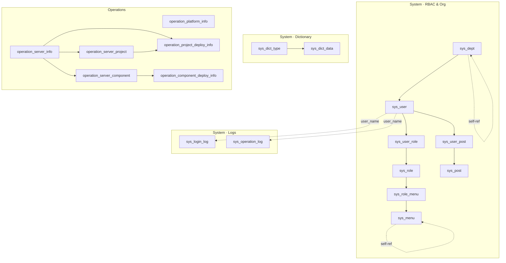
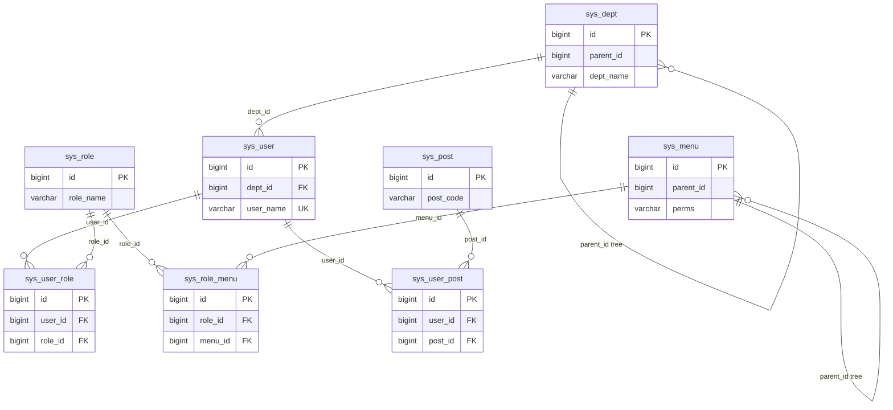
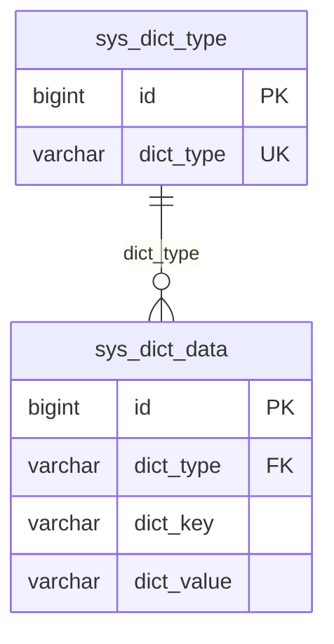
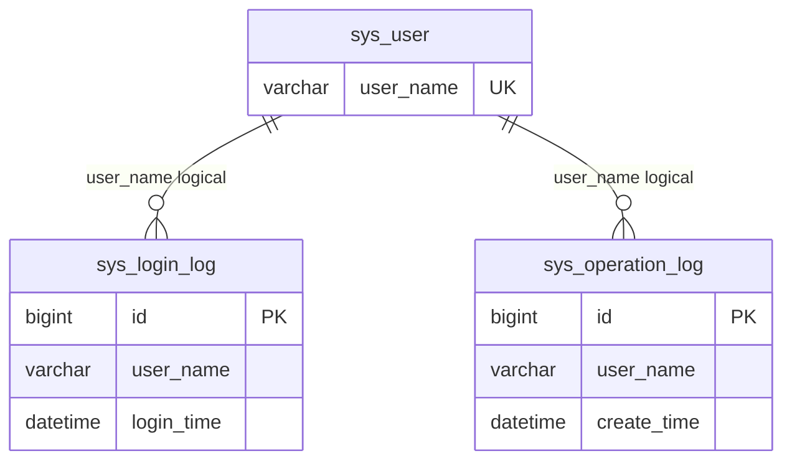
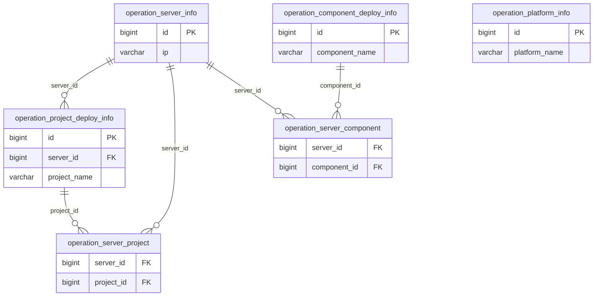

# Database Schema Diagram

Last updated: 2026-06-08  
Source: `sql/schema_moli.sql` and `moli-common` entities  
Database: `moli` (utf8mb4)

## 1. Notes

- **18** business tables: **12** system + **6** operations.
- Relationships are **logical only** — no database foreign keys in DDL.
- Primary keys are assigned by the application (`CustomIdGenerator`), not DB auto-increment.
- Keep this file in sync with `sql/schema_moli.sql` when the schema changes.

## 2. Overview

## 3. System · RBAC

**Auth path**: user → `sys_user_role` → role → `sys_role_menu` → menu (`perms` for API/button permissions).

## 4. System · Dictionary

Linked by `dict_type` string code, not by numeric `id`.

## 5. System · Logs

## 6. Operations Module

`operation_platform_info` is standalone. Component deploy info also references servers via `server_ip` (weak string link).

## 7. Table Index

| Table | Description | Module |
|-------|-------------|--------|
| `sys_dept` | Department | System |
| `sys_user` | User | System |
| `sys_role` | Role | System |
| `sys_menu` | Menu | System |
| `sys_post` | Post | System |
| `sys_user_role` | User–Role | System |
| `sys_role_menu` | Role–Menu | System |
| `sys_user_post` | User–Post | System |
| `sys_dict_type` | Dict type | System |
| `sys_dict_data` | Dict data | System |
| `sys_login_log` | Login log | System |
| `sys_operation_log` | Operation log | System |
| `operation_platform_info` | Platform | Ops |
| `operation_server_info` | Server | Ops |
| `operation_project_deploy_info` | Project deploy | Ops |
| `operation_component_deploy_info` | Component deploy | Ops |
| `operation_server_project` | Server–Project | Ops |
| `operation_server_component` | Server–Component | Ops |

## 8. Related Files

- DDL: [`sql/schema_moli.sql`](../sql/schema_moli.sql)
- Entities: `moli-common/src/main/java/com/moli/common/domain/entity/`
- Chinese version: [database-schema-diagram.md](database-schema-diagram.md)
