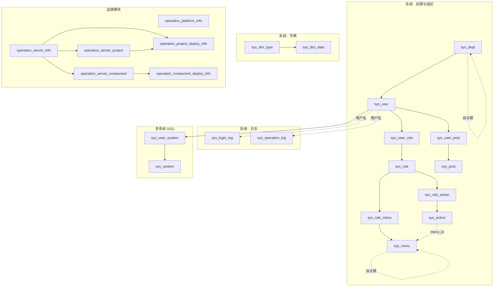
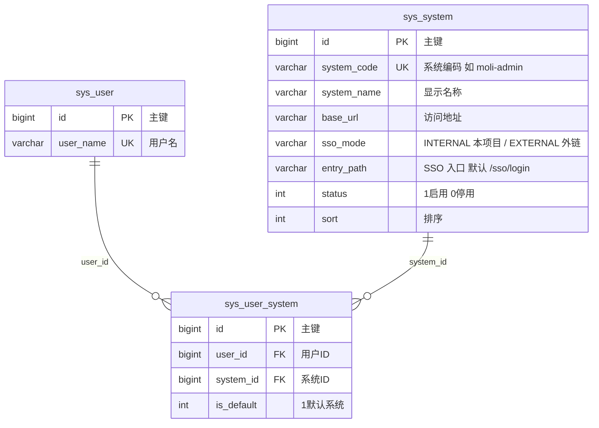
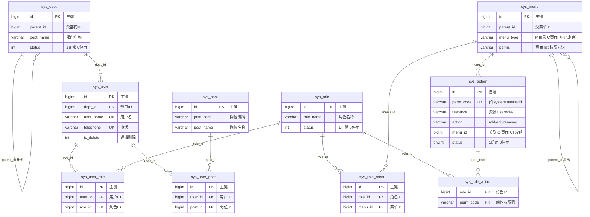
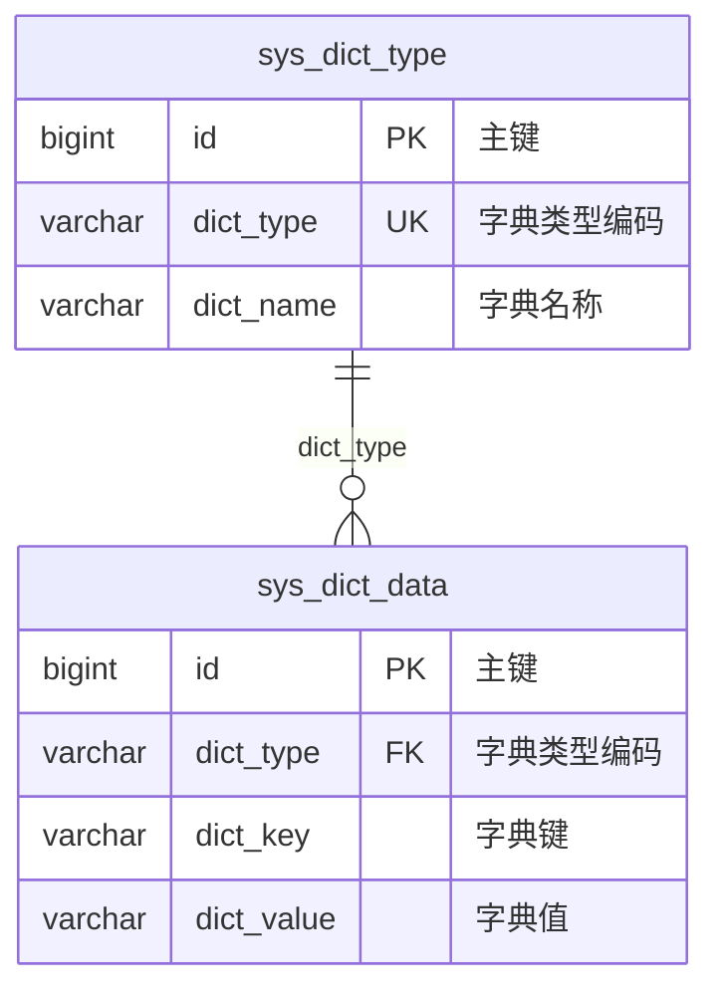
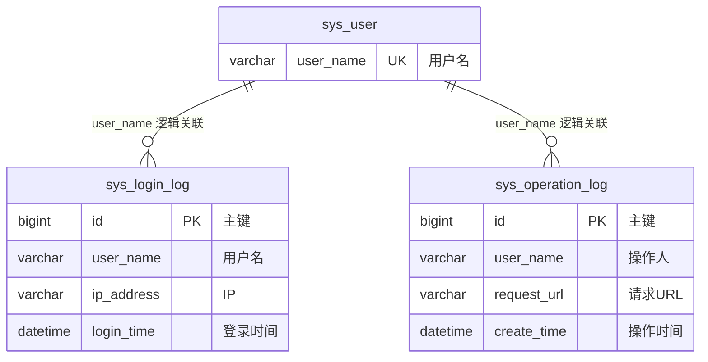
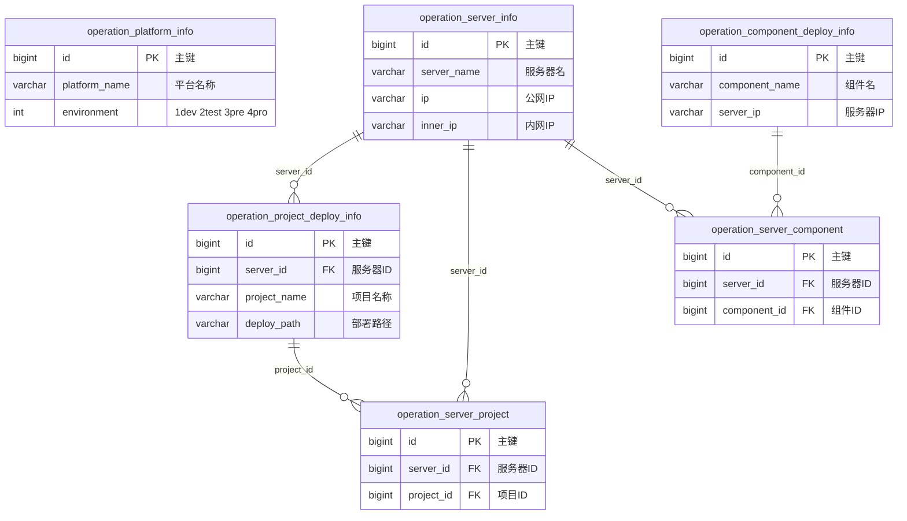

# 数据库表关系图

最后更新: 2026-06-12  
数据来源: `docs/sql/00_schema.sql` 与 `moli-common` 实体类  
数据库名: `moli`（utf8mb4）

## 1. 说明

- 共 **22** 张业务表：系统模块 **16** 张（含动作权限 **2** 张、多系统 SSO **2** 张）、运维模块 **6** 张。
- 表间为 **逻辑关联**，DDL 中 **未声明数据库外键**（`FOREIGN_KEY_CHECKS = 0`），由应用层维护一致性。
- 主键 `id` 多数由应用侧 `CustomIdGenerator` 赋值；**例外**：`sys_action.id` 为数据库 **AUTO_INCREMENT**。
- 权限模型：页面权限仍在 `sys_menu.perms`（C 菜单）；动作权限在 `sys_action` + `sys_role_action`（见 [action-permission-design.md](action-permission-design.md)）。
- 结构变更时请同步更新本文件，并执行 `python scripts/export_db_baseline.py` 重导出 `docs/sql/`。

## 2. 总览

## 3. 多系统 SSO（新增 2 表）

多系统门户 **只新增下面 2 张表**；Ticket 存 **Redis**，不落库。本系统内角色菜单仍用既有 RBAC 表（`sys_user_role` 等），**未新增** `system_id` 字段。

| 表 | 作用 |
|----|------|
| `sys_system` | 登记可进入的**业务系统**（本项目 `moli-admin`、CRM 等）；含跳转 URL、SSO 模式 |
| `sys_user_system` | 用户**能进哪些系统**（系统准入）；与 `sys_user_role`（本系统内能干什么）分开 |

**与现有表的关系**

| 已有表 | 与 SSO 的关系 |
|--------|----------------|
| `sys_user` | `sys_user_system.user_id` → 谁被分配了哪些系统 |
| `sys_user_role` / `sys_role_menu` / `sys_menu` | **不变**；管 moli-admin **内部**页面导航 |
| `sys_action` / `sys_role_action` | **新增**；管写操作动作（add/edit/remove 等），与 C 菜单 `list` 并集下发 |
| `operation_platform_info` | **无关**；运维外部平台账号，不是 SSO 业务系统 |

DDL：已合并进 `docs/sql/00_schema.sql`（含 `sys_system` / `sys_user_system`）。

## 4. 系统模块 · 权限与组织（RBAC）

**关系摘要**

| 关系 | 类型 | 关联字段 | 业务含义 |
|------|------|----------|----------|
| 部门 ↔ 部门 | 1:N 树 | `sys_dept.parent_id` → `sys_dept.id` | 组织架构层级 |
| 部门 → 用户 | 1:N | `sys_user.dept_id` → `sys_dept.id` | 用户归属部门 |
| 用户 ↔ 角色 | M:N | `sys_user_role` | 一个用户可多角色 |
| 角色 ↔ 菜单 | M:N | `sys_role_menu` | 角色授权菜单/按钮 |
| 菜单 ↔ 菜单 | 1:N 树 | `sys_menu.parent_id` → `sys_menu.id` | 目录/菜单/按钮树 |
| 用户 ↔ 岗位 | M:N | `sys_user_post` | 用户兼任岗位 |

**鉴权链路**: 用户 → `sys_user_role` → 角色 → `sys_role_menu` → 菜单（`perms` 为接口/按钮权限标识）。

## 5. 系统模块 · 字典

`sys_dict_data.dict_type` 与 `sys_dict_type.dict_type` 通过 **字符串编码** 关联，非 `id` 外键。

## 6. 系统模块 · 日志

- `sys_login_log`：登录成功/失败时由 `LoginController` 写入。
- `sys_operation_log`：由 AOP 切面记录接口操作，与用户表无物理外键。

## 7. 运维模块

**关系摘要**

| 关系 | 类型 | 关联字段 | 说明 |
|------|------|----------|------|
| 服务器 → 项目部署 | 1:N | `operation_project_deploy_info.server_id` | 项目落在哪台服务器 |
| 服务器 ↔ 项目 | M:N | `operation_server_project` | 多对多关联表 |
| 服务器 ↔ 组件 | M:N | `operation_server_component` | 组件部署关联 |
| 平台信息 | 独立 | — | `operation_platform_info` 无外键关联 |

`operation_component_deploy_info` 通过 `server_ip` 与服务器做 **弱关联**（字符串 IP），未使用 `server_id`。

## 8. 表清单

| 表名 | 中文名 | 模块 |
|------|--------|------|
| `sys_system` | 业务系统注册 | 多系统 SSO |
| `sys_user_system` | 用户-系统准入 | 多系统 SSO |
| `sys_dept` | 部门 | 系统 |
| `sys_user` | 用户 | 系统 |
| `sys_role` | 角色 | 系统 |
| `sys_menu` | 菜单（M/C；F 已废弃） | 系统 |
| `sys_action` | 动作目录 | 系统 · 权限 |
| `sys_role_action` | 角色-动作 | 系统 · 权限 |
| `sys_post` | 岗位 | 系统 |
| `sys_user_role` | 用户-角色 | 系统 |
| `sys_role_menu` | 角色-菜单 | 系统 |
| `sys_user_post` | 用户-岗位 | 系统 |
| `sys_dict_type` | 字典类型 | 系统 |
| `sys_dict_data` | 字典数据 | 系统 |
| `sys_login_log` | 登录日志 | 系统 |
| `sys_operation_log` | 操作日志 | 系统 |
| `operation_platform_info` | 运营平台 | 运维 |
| `operation_server_info` | 服务器 | 运维 |
| `operation_project_deploy_info` | 项目部署 | 运维 |
| `operation_component_deploy_info` | 组件部署 | 运维 |
| `operation_server_project` | 服务器-项目 | 运维 |
| `operation_server_component` | 服务器-组件 | 运维 |

## 9. 相关文件

- DDL + 种子: [`docs/sql/00_schema.sql`](sql/00_schema.sql)、[`docs/sql/01_baseline_data.sql`](sql/01_baseline_data.sql)
- 实体类: `moli-common/src/main/java/com/moli/common/domain/entity/`
- 英文版: [database-schema-diagram.en.md](database-schema-diagram.en.md)
