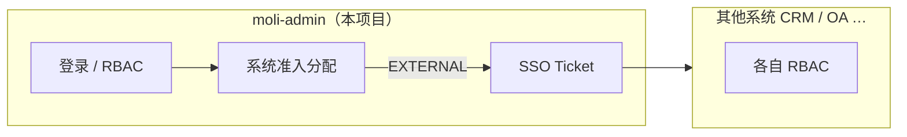

# 多系统权限与单点登录（SSO）设计方案

最后更新: 2026-06-11  
状态: **Phase 1 已落地**  
架构: **moli-admin 统一登录 + 各系统各自授权**

> **命名说明**：业务上本项目就是 **moli-admin**。仓库里 Maven 模块目录名为 `moli-server`，仅是工程结构，**不是另一个系统**，文档不再把二者拆成「中心 / 子系统」两套称呼。

## 1. 本项目做什么

**moli-admin**（本仓库）包含：

| 能力 | 说明 |
|------|------|
| 登录与 Session | `POST /login`、Shiro + Redis |
| 本系统 RBAC | 用户 / 角色 / 菜单 / 部门 / 字典 / 日志 |
| 多系统门户 | 登录后展示用户可进入的系统列表 |
| 系统准入配置 | 用户管理里分配「能进哪些系统」 |
| SSO Ticket | 跳转 **其他系统** 时发 Ticket；`POST /sso/validate` 供对方校验 |

**其他系统**（`ssoMode=EXTERNAL`）独立部署，菜单角色在对方库里配置。moli-admin **不下发**外部系统的 perms。

## 2. 权限两层

| 层级 | 在哪配置 | 接口 |
|------|----------|------|
| **能进哪些系统** | moli-admin 用户管理 | `PUT /user/insertUserSystem` |
| **进系统后能干什么** | moli-admin 配本系统角色；其他系统各自配置 | `PUT /user/insertUserRole`（仅本系统） |

## 3. `sys_system` 注册表

| system_code | 含义 | sso_mode |
|-------------|------|----------|
| `moli-admin` | **本项目自身**（门户点进来加载本库菜单） | INTERNAL |
| `crm` 等 | 其他独立系统 | EXTERNAL |

### 3.1 门户分组 `system_group`

选系统页按业务域分组展示（与侧栏 `sys_menu` 分组无关）。枚举与前端规范见 **[portal-system-group.md](portal-system-group.md)**。

| system_group | 含义 | 示例 |
|--------------|------|------|
| `platform` | 平台与治理 | `moli-admin` |
| `business` | 业务应用 | `crm-demo`、电商、会员、OA 办公 |
| `data` | 数据平台 | BI、指标、数仓、数据治理 |
| `tech` | 技术类平台 | API 网关/开放平台、低代码、CI/CD、AI Copilot |
| `ops` | 运维与保障 | `moli-ops` |

迁移：已合并至全库快照 `scripts/moli.sql`。

## 4. 流程简述

1. 用户在 **moli-admin** 登录 → 返回 `systemList`（门户开启时）及上下文（见 §4.1）。
2. 点 **本项目** → `POST /system/enter` → 返回本库 `menuVoList`（及 P1 起 `permissions`）。
3. 点 **其他系统** → 返回 `redirectUrl` + Ticket → 对方 `validate` 后走对方 RBAC。
4. 切换系统不重新输密码（同一 Session）。

### 4.1 登录响应分支与 permissions（P1）

`LoginController.fillLoginContext` 决定登录后是否带菜单、是否自动进入系统。**动作权限**（按钮预检用 `permissions` 数组）须与菜单在同一上下文下发，详见 [action-permission-design.md](action-permission-design.md) §5.5。

| 条件 | 登录响应 | 前端下一步 | permissions 来源（P1） |
|------|----------|------------|------------------------|
| 门户关闭 `systemPortalEnabled=false` | `menuVoList` | 直接进 `/` | **`LoginVo.permissions`**（不走 enter） |
| 门户开 + 0 系统 | 空菜单 | 报错无系统 | — |
| 门户开 + 1 个 INTERNAL | `currentSystem` + `menuVoList` | 进默认业务页 | **`LoginVo.permissions`**（后端内部 enter，前端不调 enter API） |
| 门户开 + 多系统 | 空菜单 | `/system-select` | 用户 `POST /system/enter` 后 **`SystemEnterVo.permissions`** |

现网缺口：`LoginVo` 仅有 `fullPermission`，无 `permissions`；单系统自动进时 `fillLoginContext` 只拷贝 `currentSystem` + `menuVoList`。P1 须扩展 `LoginVo` / `SystemEnterVo` 并补齐拷贝；前端 `handlePostLogin` 用 `savePermissions`，缺失时 `ensurePermissionsLoaded()` → `GET /auth/capabilities` 兜底。

**外部系统（EXTERNAL）** 仍不在 moli-admin 下发业务 `permissions`（§1）。

## 5. 接口（均在 moli-admin / 模块 `moli-server`）

| 路径 | 说明 |
|------|------|
| `POST /login` | 登录 |
| `GET /system/my` | 可访问系统列表 |
| `POST /system/enter`、`/system/switch` | 进入 / 切换 |
| `POST /sso/validate` | 给其他系统校验 Ticket |
| `GET /user/getSystemByUserId/{id}` | 查用户已分配系统 |
| `PUT /user/insertUserSystem` | 保存用户可访问系统 |
| CRUD `/system` | 系统注册（`system:system:list` + 超管增删改） |

## 6. 管理员操作

1. 超管维护 `sys_system`（登记 CRM 等外链）。
2. 用户管理 → **分配系统**（`insertUserSystem`）。
3. 用户管理 → **分配角色**（`insertUserRole`，仅本系统内权限）。

## 7. 相关文档

- [其他系统接入说明](subsystem-sso-integration.md)
- [动作权限与 permissions 下发](action-permission-design.md) — `LoginVo` / enter / capabilities 主次与登录路径
- [接口迭代地图](api-iteration-map.md)
- [前端开发与联调指南](../meiling-ui/docs/sso-frontend-dev-guide.md)（`meiling-ui` 仓库）
- 迁移脚本：已合并至 `docs/sql/` 基线
