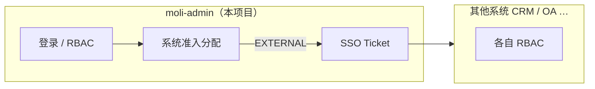

# 多系统权限与单点登录（SSO）设计方案

最后更新: 2026-06-10  
状态: **Phase 1 已落地**  
架构: **moli-admin 统一登录 + 各系统各自授权**

> **命名说明**：业务上本项目就是 **moli-admin**。仓库里 Maven 模块目录名为 `moli-server`，仅是工程结构，**不是另一个系统**，文档不再把二者拆成「中心 / 子系统」两套称呼。

## 1. 本项目做什么

**moli-admin**（本仓库）包含：

| 能力 | 说明 |
|------|------|
| 登录与 Session | `POST /login`、Shiro + Redis |
| 本系统 RBAC | 用户 / 角色 / 菜单 / 部门 / 字典 / 日志 |
| 多系统门户 | 登录后展示用户可进入的系统列表 |
| 系统准入配置 | 用户管理里分配「能进哪些系统」 |
| SSO Ticket | 跳转 **其他系统** 时发 Ticket；`POST /sso/validate` 供对方校验 |

**其他系统**（`ssoMode=EXTERNAL`）独立部署，菜单角色在对方库里配置。moli-admin **不下发**外部系统的 perms。

## 2. 权限两层

| 层级 | 在哪配置 | 接口 |
|------|----------|------|
| **能进哪些系统** | moli-admin 用户管理 | `PUT /user/insertUserSystem` |
| **进系统后能干什么** | moli-admin 配本系统角色；其他系统各自配置 | `PUT /user/insertUserRole`（仅本系统） |

## 3. `sys_system` 注册表

| system_code | 含义 | sso_mode |
|-------------|------|----------|
| `moli-admin` | **本项目自身**（门户点进来加载本库菜单） | INTERNAL |
| `crm` 等 | 其他独立系统 | EXTERNAL |

## 4. 流程简述

1. 用户在 **moli-admin** 登录 → 返回 `systemList`。
2. 点 **本项目** → `POST /system/enter` → 返回本库 `menuVoList`。
3. 点 **其他系统** → 返回 `redirectUrl` + Ticket → 对方 `validate` 后走对方 RBAC。
4. 切换系统不重新输密码（同一 Session）。

## 5. 接口（均在 moli-admin / 模块 `moli-server`）

| 路径 | 说明 |
|------|------|
| `POST /login` | 登录 |
| `GET /system/my` | 可访问系统列表 |
| `POST /system/enter`、`/system/switch` | 进入 / 切换 |
| `POST /sso/validate` | 给其他系统校验 Ticket |
| `GET /user/getSystemByUserId/{id}` | 查用户已分配系统 |
| `PUT /user/insertUserSystem` | 保存用户可访问系统 |
| CRUD `/system` | 系统注册（超管） |

## 6. 管理员操作

1. 超管维护 `sys_system`（登记 CRM 等外链）。
2. 用户管理 → **分配系统**（`insertUserSystem`）。
3. 用户管理 → **分配角色**（`insertUserRole`，仅本系统内权限）。

## 7. 相关文档

- [其他系统接入说明](subsystem-sso-integration.md)
- [接口迭代地图](api-iteration-map.md)
- 迁移脚本：`sql/migrate_sys_system.sql`
